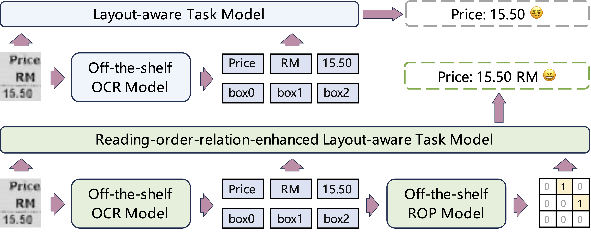

# Modeling Layout Reading Order as Ordering Relations for Visually-rich Document Understanding

This is the official code implementation of the proposed methods introduced in the [EMNLP 2024 paper](https://arxiv.org/abs/2409.19672) and the [EACL 2026 paper](https://arxiv.org/abs/2402.02379): 
1. The relation-extraction-based reading order prediction method on the ROOR dataset;
2. The reading-order-relation-enhanced (RORE) methods on several VrD tasks;
3. The comprehensive evaluation on pre-trained text-ad-layout models with EC_FUNSD. 

<div align=center>

</div>

To run these codes, please refer to the README file in the corresponding directories: reading order prediction at `rop/`, and RORE and evaluation at `rore/`. 
For the proposed ROOR dataset, please refer to [ROOR-Datasets](https://github.com/chongzhangFDU/ROOR-Datasets).

## Citation

If the work is helpful to you, please kindly cite the paper as:

```
@article{zhang2024modeling,
  title={Modeling Layout Reading Order as Ordering Relations for Visually-rich Document Understanding},
  author={Zhang, Chong and Tu, Yi and Zhao, Yixi and Yuan, Chenshu and Chen, Huan and Zhang, Yue and Chai, Mingxu and Guo, Ya and Zhu, Huijia and Zhang, Qi and others},
  journal={arXiv preprint arXiv:2409.19672},
  year={2024}
}

@misc{zhang2025unveilingdeficienciespretrainedtextandlayout,
      title={Unveiling the Deficiencies of Pre-trained Text-and-Layout Models in Real-world Visually-rich Document Information Extraction}, 
      author={Chong Zhang and Yixi Zhao and Yulu Xie and Chenshu Yuan and Yi Tu and Ya Guo and Mingxu Chai and Ziyu Shen and Yue Zhang and Qi Zhang},
      year={2025},
      eprint={2402.02379},
      archivePrefix={arXiv},
      primaryClass={cs.CL},
      url={https://arxiv.org/abs/2402.02379}, 
}
```

## Requirements

* The experiments require at least 24GB GPU memory and CUDA 11.3.
* Please make sure that `torchtext` is not installed, which could possibly cause unknown problems with `pytorch-lightning` installed. 

```bash
conda create -n LayoutIE python=3.8
conda activate LayoutIE
pip install pip==24.0
pip install torch==1.11.0+cu113 torchvision==0.12.0+cu113 torchaudio==0.11.0 --extra-index-url https://download.pytorch.org/whl/cu113
pip install torchmetrics==0.11.1
pip install transformers==4.26.1
pip install pytorch-lightning==1.5.9
pip install nltk==3.8.1
pip install jieba==0.42.1
pip install seqeval==1.2.2
pip install ark_nlp==0.0.9
pip install opencv-python-headless==4.7.0.68
pip install timm==0.6.12
pip install sentencepiece==0.1.97
pip install six==1.16.0
pip install textdistance==4.6.2
```
